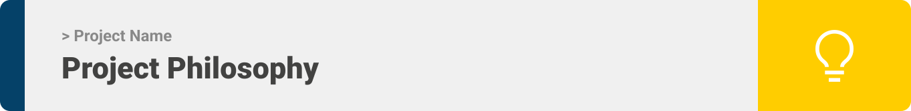
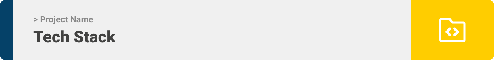
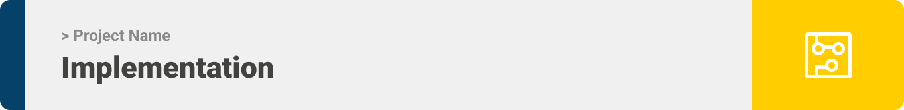

# inventory-management-application


<div align="center">

> Hello world! This is the project’s summary that describes the project plain and simple, limited to the space available. 


**[PROJECT PHILOSOPHY](https://github.com/noormesslmani/MeetALocal#-project-philosophy) •[TECH STACK](https://github.com/noormesslmani/MeetALocal#-tech-stack) • [IMPLEMENTATION](https://github.com/noormesslmani/MeetALocal#-implementation) • [HOW TO RUN?](https://github.com/noormesslmani/MeetALocal#-how-to-run)**

</div>
<br><br>


### Users Stories
- As a User, I want to display the list of product types added in a table.
- As a User, I want to to see all the items that are in the inventory correspoding to a product type.
- As a User, I want to add new products.
- As a User, I want to search products by type.
- As a User, I want to display the list of items of a certain product type in a table.
- As a User, I want to add, edit, and delete items.
- As a User, I want to create accout, login, and edit profile.
<br><br>



Here's a brief high-level overview of the tech stacks the app uses:

<br><br>
- The Project uses [React](https://reactjs.org/) which is a JavaScript library for building user interfaces allowing to compose complex UIs from small and isolated pieces of code called “components”,  and [TailwindCSS](https://tailwindcss.com/) for styling.
<br><br>
- The backend is implemented using [Laravel](https://laravel.com/) which is a free and open-source PHP web framework, intended for the development of web applications following the model–view–controller (MVC) architectural pattern.
<br><br>
- For Database the project uses [MySQL](https://www.mysql.com/) database, which is a relational database management system based on the Structured Query Language.
<br><br>

<br><br>

> Uing the above mentioned tech stacks and the user sotries we have, the implementation of the app is shown as below, these are screenshots from the real app


### Landing:
---------------

| Login  | Register | 
| ----------| ----------| 
|  |  | 

| Invalid Credentials | 
| ----------| 
|  |

### Products:
---------------

| Products Table  | Add Product |
| ----------| ----------| 
|  |  |  

| Delete Product  | Search Products |
| ----------| ----------| 
|  |  | 


### Items:
---------------

| Items Table  | Add Items |
| ----------| ----------| 
|  |  |  

| Delete Item | Search Items |
| ----------| ----------|  
|  |  |

| Edit Item | 
| ----------| 
|  |

### Profile:
---------------

| Edit Profile | Change Password|
| ----------| ----------|  
|  |  |

<br><br>


> This is an example of how you may give instructions on setting up your project locally.
To get a local copy up and running follow these simple example steps.


### Prerequisites

* npm
  ```sh
  npm install npm@latest -g
  ```

* [Composer](https://getcomposer.org/download/)
*  Apache HTTP Server, example : [XAMPP](https://www.apachefriends.org/)

### Installation

1. Open your XAMPP control panel and start Apache and MySQL
2. Clone the repo
   ```sh
   git clone https://github.com/noormesslmani/inventory-management-application
   ```
3. Go to the inventory-management-application-server folder
   ```
   cd inventory-management-application-server
   ```
4. Install composer packages
   ```
   composer install
   ```   
5. Rename the .env.example file in the inventory-management-application-server folder to .env and specify your database name

6. Generate a secret key generate a jwt secret key
   ```
     php artisan jwt:secret
   ```
7. Migrate the database
   ```
   php artisan migrate
   ```
8. Seed the database
   ```
   php artisan db:seed
   ```
   
9. Go to the frontend folder
      ```
      cd frontend
      ```  
10. Install the dependencies
      ```
      npm install
      ```    
11. creating a .env file and add REACT_APP_BASE_URL as following:
      ```
      REACT_APP_BASE_URL: 'IP_address:host/prefix'
      ```   

