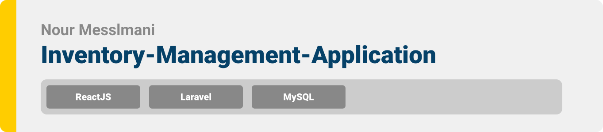

# inventory-management-application


<div align="center">

> Hello world! This is the project’s summary that describes the project plain and simple, limited to the space available. 


**[PROJECT PHILOSOPHY](https://github.com/noormesslmani/MeetALocal#-project-philosophy) •[TECH STACK](https://github.com/noormesslmani/MeetALocal#-tech-stack) • [IMPLEMENTATION](https://github.com/noormesslmani/MeetALocal#-implementation) • [HOW TO RUN?](https://github.com/noormesslmani/MeetALocal#-how-to-run)**

</div>

<br><br>


### Users Stories
- As a User, I want to display the list of product types already added in a table.
- As a User, I want to to see all the items that are in the inventory of product type clicked on.
- As a User, I want to add new products.
- As a User, I want to search pproducts by type.
- As a User, I want to display the list of items of a product type in a table.
- As a User, I want to add, edit, and delete items.
- As a User, I want to create accout, login, and edit profile.

<br><br>


Here's a brief high-level overview of the tech stacks the app uses:

<br><br>
- The Project uses [React](https://reactjs.org/) which is a JavaScript library for building user interfaces allowing to compose complex UIs from small and isolated pieces of code called “components”,  and [TailwindCSS](https://tailwindcss.com/) for styling.
<br><br>
- The backend is implemented using [Laravel](https://laravel.com/) which is a free and open-source PHP web framework, intended for the development of web applications following the model–view–controller (MVC) architectural pattern.
<br><br>
- For Database the project uses [MySQL](https://www.mysql.com/) database, which is a relational database management system based on the Structured Query Language.
<br><br>


<br><br>


> Uing the above mentioned tech stacks and the user sotries we have, the implementation of the app is shown as below, these are screenshots from the real app


### Landing:
---------------

| Login  | Register | 
| ----------| ----------| 
|  |  | 

| Invalid Credentials | 
| ----------| 
|  |

### Products:
---------------

| Products Table  | Add Product |
| ----------| ----------| 
|  |  |  

| Delete Product  | Search Products |
| ----------| ----------| 
|  |  | 


### Items:
---------------

| Items Table  | Add Items |
| ----------| ----------| 
|  |  |  

| Delete Item | Search Items |
| ----------| ----------|  
|  |  |

| Edit Item | 
| ----------| 
|  |

### Profile:
---------------

| Edit Profile | Change Password|
| ----------| ----------|  
|  |  |


---------------


> This is an example of how you may give instructions on setting up your project locally.
To get a local copy up and running follow these simple example steps.


### Prerequisites

- Download and Install [Composer](https://getcomposer.org/download/)
- Download and Install [XAMPP](https://www.apachefriends.org/download.html)

- npm
  ```sh
  npm install npm@latest -g
  ```
- Expo CLI
  ```sh
  npm install --global expo-cli


### Installation

1. Clone the repo

   ```sh
   git clone https://github.com/noormesslmani/MeetALocal.git
   ```
#### To Run The Mobile App

1. Navigate to MeetALocal-rn folder and install dependencies
   ```sh
   cd MeetALocal/MeetALocal-rn
   npm install
   ```
2. Run the start up command
   ```sh
   npm start
   ```
3. Place your IP address in constants/address

4. Create an [API key](https://developers.google.com/maps/documentation/javascript/get-api-key) and place it in .env file

5. Scan the generated QR code with your camera (ios) or through the Expo Go application (android)

#### To Run The Desktop App

1. Navigate to admin-panel folder and install dependencies
   ```sh
   cd MeetALocal/admin-panel
   npm install
   ```
2. Place your IP address in Network/API

3. Run the start up command
   ```sh
   npm start
   ```

#### To Run Laravel Server on your machine

1. Create a database locally named meetalocaldb

2. Navigate to the backend folder
   ```sh
   cd MeetALocal/MeetALocal-Backend
   ```
3. Install dependencies
   ```sh
   composer install 
   ```
4. Rename .env.example to .env and inside the .env file 
   - Insert the db name as follow -> DB_DATABASE= -> DB_DATABASE=meetalocal
   
5. Run migration
   ```sh
   php artisan migrate
   ```
   
6. Start the Server
   ```sh
   php artisan serve --port 8000 --host "Your IP"
   ```
